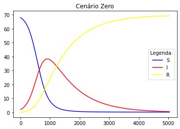
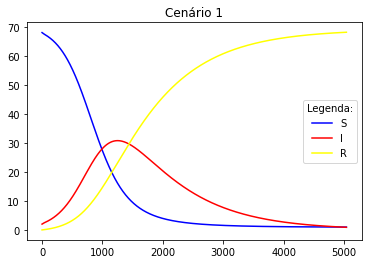
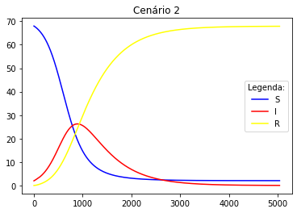

<h2 align="center"> 
  :microscope: Projeto Final da Matéria de ITP
</h1>

  
  
  
  
  

  
   

### :man_technologist: Autores
* **Frank Laércio** - [franklaercio](https://github.com/franklaercio)
* **Ohanna Dezidério** - [ohannadeziderio](https://github.com/ohannadeziderio)

### :bookmark_tabs: Resumo do Projeto
Abaixo segue uma breve descrição do problema proposto:

> 
 Modelos epidemiológicos computacionais (MEC) são utilizados para a compreensão da dinâmica de uma epidemia ou afim, e são, portanto, ferramentas essenciais na determinação de políticas públicas para combate e prevenção de doenças.  A transmissão de uma doença infecciosa pode ocorrer por diversas formas, como contato direto entre indivíduos, por via aérea, por contato com superfícies contaminadas, via vetor de transmissão, dentre outros. Um MEC bastante utilizado é conhecido como Suscetível-Infectado-Removido (SIR).

  O projeto contém o arquivo "main.c", que é responsável por abrir o arquivo com os parâmetros das equações e fazer os cálculos dos cenários propostos. Na biblioteca "methods.c" é possível encontrar os métodos utilizados para calcular o SRI. Além disso, vale ressaltar que todos os métodos estão anotados no arquivo "methods.h".  
  Ademais, o processo de desenvolvimento foi dividido em dois checkpoints. No primeiro, buscou-se criar os arquivos iniciais, definindo a estrutura do projeto, ou seja, separando os arquivos no “main.c”, "methods.c" e "methods.h”. Além disso, nessa etapa buscou-se ler de um arquivo “.txt” os parâmetros iniciais necessários para calcular o SRI. Para isso, foi necessário utilizar a função “fopen”. Logo em seguida, calcularam-se as constantes b e k, de acordo com valores obtidos do arquivo “input.txt”. Por fim, para o primeiro cálculo do SRI utilizou-se a alocação dinâmica para criar os vetores S, R, I e tempo, e após isso somente foi necessário utilizar alguns parâmetros lidos pelo arquivo “input.txt”, utilizar a fórmula dada pelo desafio e fazer a exportação em um arquivo “.csv”, que basicamente abre um novo “.csv”,  percorre um laço e preenche as linhas com  os dados de S, R, I e tempo.  
  No dia 2 de dezembro, o professor deu algumas orientações para serem feitas no checkpoint 2, por exemplo, ajustar a alocação dinâmica que estava senda feita ao recuperar os parâmetros iniciais para o cálculo do SRI, adicionar os comentários nas funções e utilizar struct no projeto.  
  Dessa forma, no checkpoint 2, corrigimos o que foi apontado pelo professor como melhorias a serem implementadas. Após isso, adicionamos os cenários extras propostos, que basicamente muda alguns parâmetros iniciais. Isso implica em modificações no cálculo das constantes b e k após um certo intervalo de tempo. O cálculo é o mesmo do cenário base, o que muda é após chegar em um certo intervalo de tempo, as suas constantes sofrem modificações e isso interfere na exportação do gráfico resultante.  

Gráfico do cenário 0:  

Gráfico do cenário 1:  

Gráfico do cenário 2:  

### :heavy_check_mark: Divisão das Tarefas do Checkpoint 1:
#### Frank:
- Criar os arquivos inicias do projeto
- Ler os dados de entrada
- Calcular o SRI
#### Ohanna:
- Calcular os dados de b e k
- Exportar o resultado do SRI para CSV
- Iniciar a documentação

### :heavy_check_mark: Divisão das Tarefas do Checkpoint 2:
#### Frank:
- Fazer modificações apontadas pelo professor
- Atualizar o README
#### Ohanna:
- Fazer a função que calcula os cenários 1 e 2
- Exportar os gráficos

### :mag_right: Como executar o projeto

1. Clone este repositório  
`git clone https://github.com/franklaercio/ProjetoFinalITP.git`  
2. Vá no diretório que ele foi clonado e execute os comandos abaixo  
`gcc main.c methods.c -o main` e `./main`  

### :newspaper: Palavras Chaves

- C
- SRI
- MEC
